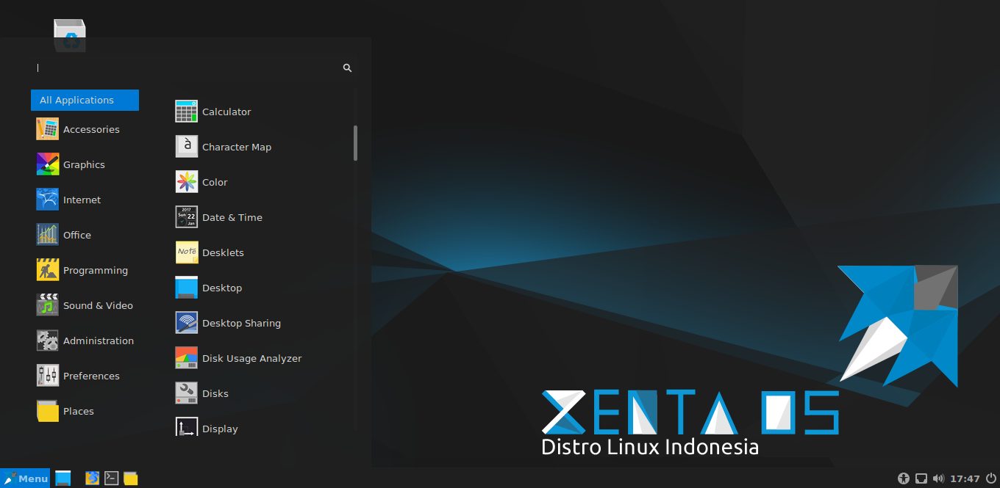
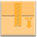
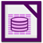

## Bagian Bagian Desktop E**nvironment** Cinnamon {#bagian-bagian-desktop-environment-cinnamon}

### Pengenalan Desktop {#pengenalan-desktop}

Keterangan :

### Pengenalan Menu {#pengenalan-menu}

Pada Apples Menu terdapat bagian bagian seperti kategori menu, kolom pencarian dan lain lain selebihnya lihat gambar dibawah ini :

Penjelasan :

1\. Applets Menu

2\. Applets Show Desktop

3\. Applets Shorcut Aplikasi

4\. Kategori Menu

5\. Menu Aplikasi Sesuai Kategori

Menu yang dipilih

6\. Scrollbar (Tombol Gulir)

7\. Search Bar (Kolom Tempat Mencari File atau Aplikasi)

1

3

4

6

7

Keterangan :

2

5

#### Bagian Menu Aplikasi {#bagian-menu-aplikasi}

Xenta OS menyediakan aplikasi langsung yang disertakan secara default ketika Anda menginstal Xenta OS dikatakan bagian dari &quot;Default Software Selection&quot;.

Pada bagian kanan menu, Anda dapat melihat semua aplikasi yang diinstal. Aplikasi-aplikasi tersebut dikelompokkan berdasarkan kategori. Kategori pertama disebut &quot;All Applications&quot; dan, seperti yang mungkin Anda duga, itu menunjukkan daftar semua aplikasi yang terinstal.

##### Pada Menu Kategori “Accessories” {#pada-menu-kategori-accessories}

Anda akan menemukan aplikasi berikut :

| Icon Aplikasi | Nama Aplikasi | Deskripsi Aplikasi |
| --- | --- | --- |
|  | Alldeb Manager |  |
|  | Archive Manager | Aplikasi untuk membuat atau menekstrak arsip (Zip, Tar, dan |
|  | Calculator | Sebuah kalkulator |
|  | Character Map | Sebuah alat untuk menyalin dan menyisipkan karakter khusus |
|  | Disks | Sebuah alat yang menunjukkan Anda bagaimana hard drive Anda |
|  | Document Viewer | Sebuah alat untuk melihat PDF dan dokumen lainnya. |
|  | Files | Sebuah link untuk direktori Home di Nemo File Manager |
|  | Font Viewer | Sebuah alat untuk melihat font yang tersedia. |
|  | Help | Sebuah alat untuk mencari bantuan (manual page). |
|  | Image Viewer | Aplikasi untuk melihat foto. |
|  | Passwords and Keys | Sebuah alat untuk mengelula password |
|  | Screen Reader | Sebuah alat untuk screen reader (pembaca screen) utilitas assebility |
|  | Screenshot | Sebuah alat untuk mengambil screenshot. Anda juga dapat |
|  | Text Editor | Xed, sebuah aplikasi editor teks |
|  | Tomboy Notes | Sebuah aplikasi untuk menulis catatan |
|  | USB Image Writer | Sebuah alat sederhana untuk menulis file ISO ke USB Drive |
|  | USB Stick Formatter | Sebuah alat untuk membersihkan dan memformat USB Drive |

##### Pada Menu Kategori “Graphics” {#pada-menu-kategori-graphics}

Anda dapat menemukan aplikasi berikut :

| Icon Aplikasi | Nama Aplikasi | Deskripsi Aplikasi |
| --- | --- | --- |
|  | GIMP Image Editor | Aplikasi yang memungkinkan Anda untuk memperbaiki, merubah atau bahkan membuat gambar. Padanan terbaik Linux bagi |
|  | Inkscape | Aplikasi yang memungkinkan Anda untuk memperbaiki, merubah atau bahkan membuat gambar vector. Alternatif terbaik Linux bagi Corel Draw. |
|  | Pix | Aplikasi untuk menata foto. |
|  | Simple Scan | Aplikasi untuk menscan dokument dari perangkat scanner. |

##### Pada Menu Kategori “Internet” {#pada-menu-kategori-internet}

Anda dapat menemukan aplikasi berikut :

| Icon Aplikasi | Nama Aplikasi | Deskripsi Aplikasi |
| --- | --- | --- |
|  | Dropbox | Sebuah aplikasi file cloud (Media Penyimpanan file di internet) |
|  | Filezilla | Sebuah aplikasi client FTP manager |
|  | Firefox Web Browser | Sebuah peramban web. |
|  | Hexchat | Aplikasi Chating Internet Relay Chat (IRC) |
|  | Liferea | Aplikasi Pembaca Feed Website dan Blog. |
|  | Transmission | Torrent Client. |

##### Pada Menu Kategori “Office” {#pada-menu-kategori-office}

Anda dapat menemukan aplikasi berikut :

| Icon Aplikasi | Nama Aplikasi | Deskripsi Aplikasi |
| --- | --- | --- |
|  |  |  |
|  | LibreOffice | General Starter untuk office suite ini. |
|  |  |  |
|  | LibreOffice Calc | Aplikasi spresdsheet (alternatif Microsoft Excel dan kompatibel dengan XLS). |
|  | LibreOffice Draw | Untuk menggambar, Bagian dari Office Suite ini. |
|  | LibreOffice Impress | Aplikasi untuk membuat presentasi dalam bentuk slide (alternatif Microsoft Powerpoint dan kompatibel dengan PPT). |
|  | LibreOffice Math | Aplikasi untuk membuat dan mengedit rumus matematika. |
|  | LibreOffice Writer | Pengolah kata (alternatif Microsoft Word dan kompatibel dengan |

##### Pada Menu Kategori “Programming” {#pada-menu-kategori-programming}

Anda dapat menemukan aplikasi berikut:

| Icon Aplikasi | Nama Aplikasi | Deskripsi Aplikasi |
| --- | --- | --- |
|  | Bluefish Editor | Editor Teks dikhususkan untuk Pengembangan Web. |
|  | Geany | Editor Teks dikhususkan untuk Pengembangan Aplikasi. Mendukung banyak basaha pemrograman seperti C, C++, Ruby, python dan lain lain. |

##### Pada Menu Kategori “Sound &amp; Video” {#pada-menu-kategori-sound-video}

Anda dapat menemukan aplikasi berikut:

| Icon Aplikasi | Nama Aplikasi | Deskripsi Aplikasi |
| --- | --- | --- |
|  | Brasero | Sebuah aplikasi burning CD/DVD. Brasero juga bisa membuat CD |
|  | Rhythmbox | Sebuah aplikasi musik untuk memutar radio online, streaming musik dari Internet dan layanan musik online dan mendengarkan koleksi file musik (alternatif untuk iTunes). Banshee juga mengelola podcast, player portabel dan dapat merobek CD. |
|  | VLC Media Player | Sebuah pemutar video, terkenal karena mampu memainkan hampir |

##### Pada Menu Kategori “Administration” {#pada-menu-kategori-administration}

Anda dapat menemukan aplikasi berikut:

|  |  |  |
| --- | --- | --- |
|  |  |  |
|  |  |  |

##### Pada Menu Kategori “Preferences” {#pada-menu-kategori-preferences}

Anda dapat menemukan aplikasi berikut:

|  |  |  |
| --- | --- | --- |
|  |  |  |
|  |  |  |
|  |  |  |
|  |  |  |

#### Bagian Kotak Pencarian {#bagian-kotak-pencarian}

Jika Anda tidak dapat mengingat bagaimana menemukan aplikasi tertentu dalam menu atau jika Anda ingin untuk mendapatkan akses lebih cepat ke sana Anda dapat menggunakan fitur pencarian.

Cukup klik pada &quot;Menu&quot; di sudut atas layar Anda dan mulai mengetik nama atau deskripsi aplikasi yang Anda cari. Saat Anda mengetik, hanya aplikasi sesuai dengan pencarian Anda akan tetap terlihat dalam menu.

#### Tips Membuat Pintasan (Shortcut) {#tips-membuat-pintasan-shortcut}

Jika Anda tidak menyukai gagasan memiliki aplikasi favorit, Anda dapat menggunakan panel atau desktop Anda untuk mencapai hasil yang sama, (yaitu, memberikan diri Anda akses cepat ke aplikasi Anda). Cukup klik kanan aplikasi pilihan Anda dari menu untuk dan pilih &quot;Add to Panel&quot; atau &quot;Add to desktop&quot;.

### Pengenalan Panel {#pengenalan-panel}

### Pengenalan Applets {#pengenalan-applets}

### Pengenalan Keyboard Shortcuts {#pengenalan-keyboard-shortcuts}