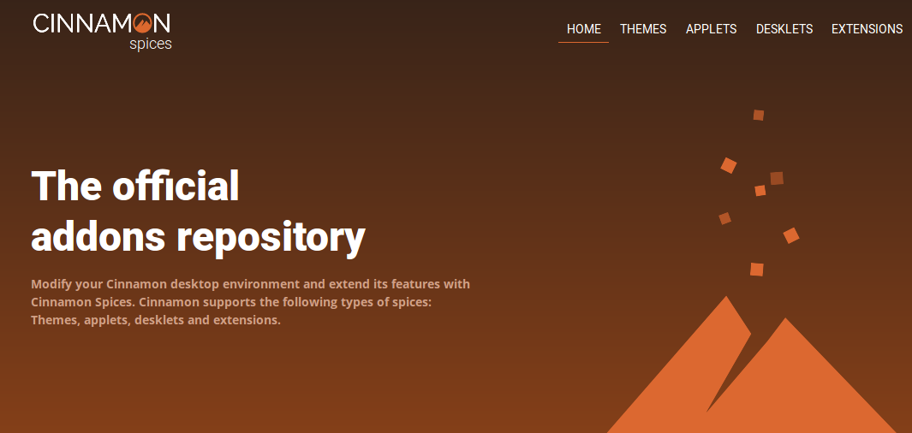

## Fitur {#fitur}

Fitur yang disediakan oleh Cinnamon termasuk

*   Efek desktop, termasuk animasi, efek transisi dan transparansi menggunakan komposisi;

*   Panel yang dilengkapi dengan menu utama, peluncur, daftar jendela dan baki sistem dapat disesuaikan di sisi kiri, kanan, atas atau bawah layar.

*   Berbagai ekstensi;

*   Applet yang muncul di panel

*   Ikhtisar dengan fungsi yang serupa dengan di GNOME Shell; dan

*   Pengaturan editor untuk kemudahan kustomisasi. Hal ini dapat menyesuaikan:

    *   Panel

    *   Kalender

    *   Tema

    *   Efek desktop

    *   Applet

    *   Ekstensi